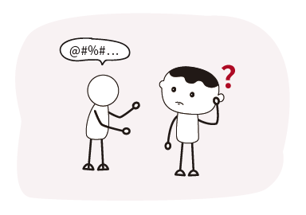

# 5.4 沟通能力

有效沟通包含两部分：倾听他人、表达自己。达成这两部分不仅是口头语言的交流，还有肢体、神态等辅助语言，以及，更重要的是毫无偏见、互相尊重、友善沟通的心态。

## 5.4.1 知彼解己

好多外行都吐槽互联网人“不说人话”，连相亲都用“水位同步”“对齐需求”“生态化反”这些黑话，那阿道可得解释一下：每个圈子都会采用“组块化策略”来讲话，以节约时间、提高沟通效率。这种“组块化策略”就像压缩包，具有解压能力的人可以轻松读懂，但没有掌握这些压缩包的圈外人却只能接收不能解压。于是就出现了“每个字我都认识可就是不知道什么意思”。

知彼解己是有效沟通的原则，首先了解对方，然后再争取让对方了解自己。所以，沟通交流之前，可以换位思考，简单判断一下对方是否会了解你的“压缩包”，如果判断对方可能不是那么容易解压，请务必采取“说人话策略”，即用深入浅出、用浅显的语言呈现复杂内容。

## 5.4.2 提升交流意愿

很多程序员更喜欢自己与代码待着，内向不是问题，但现在社会分工精细，人与人协作频繁，保持封闭拒绝交流确实无益于各方面的提升。很多价值要通过业务上的沟通交流才得以量化。所以，打开自己。

比如用直视、点头等动作来认真倾听、回应；看着对方眉心到鼻梁附近的“三角区”来进行眼神注视；开会、电话等需发言场合提前理清逻辑、分列要点。