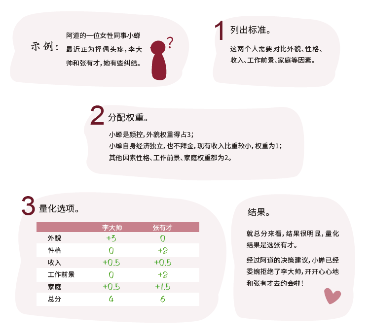
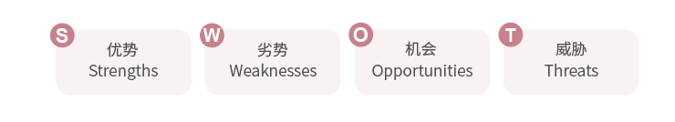
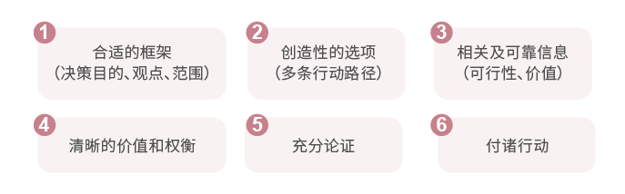

# 5.6 决策能力

复杂的决策之所以难，在于很多决策并没有统一的标准、无法被量化，甚至还有可能需要承担责任或后果。那么决策能力就是将所有标准统一，并将其量化，根据可能带来的结果做出最终选择的能力。

决策三步走：第一步，列出标准；第二步，分配权重；第三步，量化选项。将所有的分数，根据真实权重进行加权汇总，得到一个最终评分。

从决策的三个步骤出发给到大家几个决策模型，在列出标准、分配权重时可以有所帮助：

### MECE分类规则

即完全穷举，相互独立，可以用MECE 原则考虑“列出标准”时的每一条的合理性，以使各标准不存在遗漏也不会互相干扰。

### SWOT分析

S（ Strengths）是优势、W（ Weaknesses）是劣势，O（ Opportunities）是机会、T（ Threats）是威胁，将与研究对象密切相关的各种主要内部优势、劣势和外部的机会、威胁等列举出来，并以此判断每个因素在权重中所占的比例。

### 斯坦福六步法商业决策

自我管理方面，除了以上职场必备技能，还有一些结合当下现实情况的可能落地性没那么强、但确实是“掏心窝子的话”想要跟大家分享。

时代发展飞速，科技日新月异，带给我们极多便利的同时也颠覆着传统生活方式。算法的便利让大数据推送完美契合自己的喜好，可我们也日复一日被困在同质化的“信息茧房”中，只能看见井口的那一片天空；日渐被资本家鼓吹的消费主义裹挟，初中课本学的“量入为出适度消费、避免盲从理性消费”已被抛之脑后，分期付款、提前消费成了生活常态；段子、漫画、短视频无处不在，让人捧腹的同时侵蚀着深度阅读和理性思考能力。没人能做到“众人皆醉我独醒”，但在纷杂喧嚣的大环境里留一份理智，不随波逐流并不难。

越是在一个稍微动乱点的时代，静才越有价值。