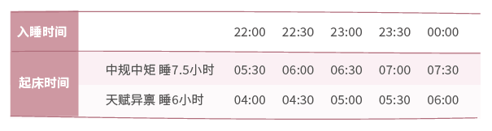
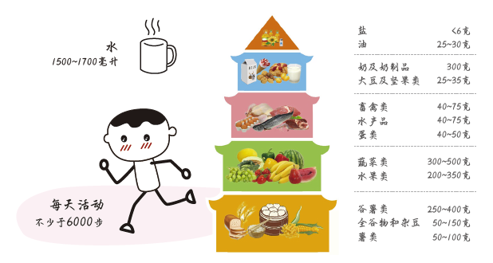
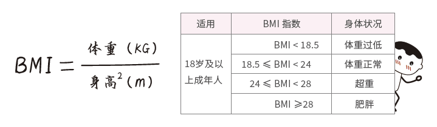
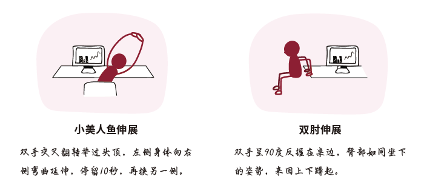
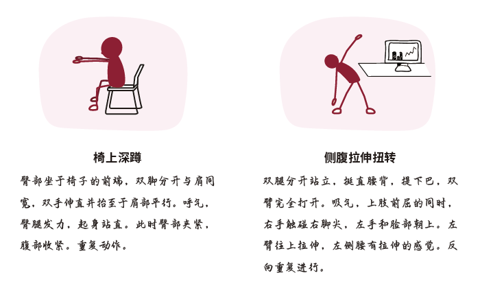

# 5.1 健康体魄

## 5.1.1 996也要睡得好！

睡眠周期：完整的浅睡眠+深睡眠周期为1.5小时，睡够完整周期倍数才能得到深入休息，醒来也不会疲乏、困倦，一般来说可以是7.5小时，自由安排睡眠时间，每天根据睡眠时间定闹钟。

日间小睡：短暂午睡不超过30分钟，时间充足的话可以睡一个周期（1.5小时）。

具体时间：睡眠时长、入睡时间、起床时间因人而异，只要睡够完整睡眠周期，不必过于纠结早睡早起。

其他 tips：胎儿型睡姿、暖光灯、热牛奶、泡脚等都有助于睡眠，可根据自己情况搭配使用。

## 5.1.2 吃好喝好烦恼少！

饮食建议方面，阿道的建议远没有官方来得科学，就直接把膳食宝塔给到你。

一定会有人开始焦虑，但悄悄告诉你，阿道也不能完全按照这个比例来吃东西！放轻松~只要你不是每天五顿饭，顿顿炸鸡啤酒小烧烤，在三餐规律、有奶蛋鱼肉菜搭配的情况下，倒也不必过于担心健康。来张BMI指数（身体质量指数）来算一下自己的体重是否符合健康程度吧。

同时也记得定期体检，除了拖延症、脱发、选择困难症等可自测的“病症”，还得注意一下当代年轻人常见的腰椎病、颈椎病，甚至日渐年轻化的糖尿病、结节等问题哦。

## 5.1.3 体育锻炼

运动的重要性不言而喻，但种种主客观原因导致没有充足的锻炼时间，那么就总结为一句话，适用于工作场合：勿久坐，多走动，有条件的可以站立办公。再来学点轻松易做的锻炼动作：

