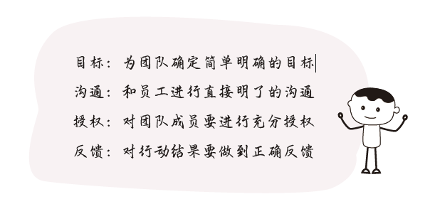

# 5.5 领导能力

领导力不是当了领导才需要的权力，而是一种前瞻性的统筹能力。领导力与职位无关，只意味着看问题的眼光能否从宏观和大局出发，以整体、均衡、多面的思路应对工作、生活乃至世界。

管理者的本质是公司相信你能为公司解决更大的问题，从而愿意分配一部分人力资源以帮助你更高效地解决问题。既要你深入一线工作，又要有一定的带队能力，让团队发挥更大价值。

有无领导力的表现，对个人来说在于能否敢于授权与勇于担责，对团队来说在于有没有结果和有没有状态。有领导力的人懂得授权激励，让专业的人做专业的事；没领导力的人事无巨细、亲力亲为。有领导力的人能调动团队积极性，引导每个人发挥潜在优势，并达成一致的团队目标；没领导力的人徒有严格的等级关系，团队毫无凝聚力，更别提共同完成任务。

要想简单高效地打造领导力，只需要重点把握四个关键词：

