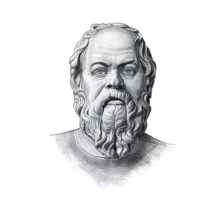
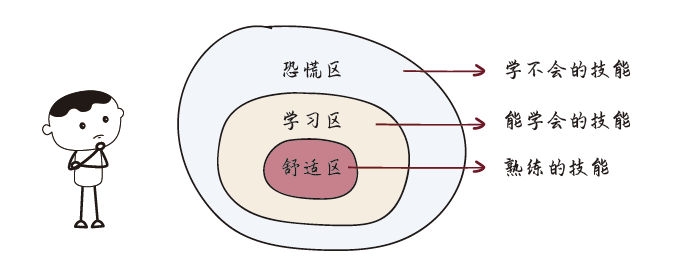

# 5.2 自我认知

“Know Yourself ”是苏格拉底的哲学思想之一，不探讨高深的哲学，生活工作里也能应用到这一先贤的思想。

清楚赖以生存的工作能力的上下限，比如代码水平。上下限之间就是你的能力圈，在这个范围内可以尽可能地拓宽边界、进行提升。清楚了上下限就不至于在面对机会时过度自信搞砸事情，或犹豫不决错失良机。上下限跨度不要过大，过大会导致工作能力的不稳定，将能力范围稳定在中高度范围。

清楚自己的优劣势。上下限更多的是如代码能力等硬技能，优劣势就包含了交际、沟通、协作等软技能。保持优势一直是稳定优势的情况下，规避劣势并有意识地学习、提升，将从不同方面带来很大程度的好处。  

但切忌出现放弃自己专长而去发展短板的情况，从这个意义上讲，超出能力圈做力所不能及的事而搞砸比陷入舒适区更可怕。