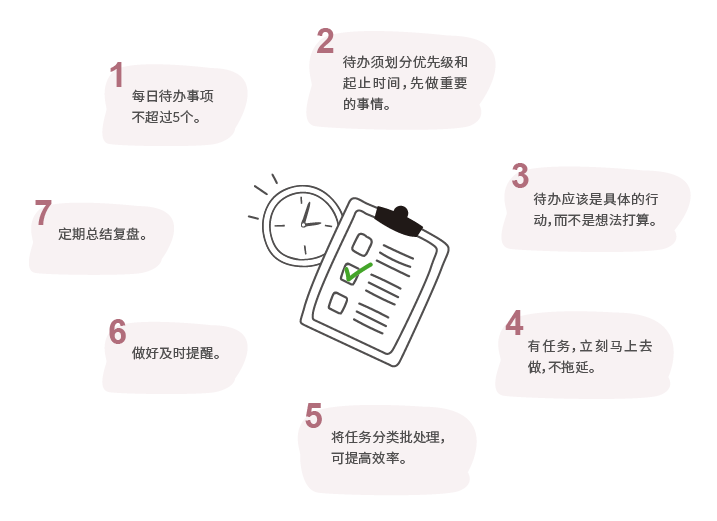
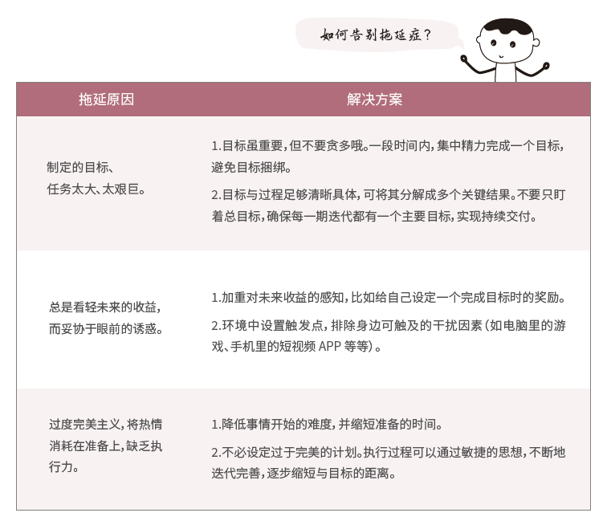

# 5.7 时间管理

无论是硬核知识技能还是软技能，最终都是要我们自己学习掌握，并落实到实践。而这个过程中，我们都会遇到一个共同难题⸺时间管理。

时间管理是一个大课题，阿道主要分享介绍一些时间管理的具体小技巧。

## 5.7.1 每日待办列表

整理每日待办列表是一种管理安排我们每天时间的有效方法。它可以让我们有限的时间更加条理化，在合适的时间做合适的事情，有目的地完成目标。列待办事项看似简单，但里面有很多小技巧和注意事项哦，这里分享给大家参考。

## 5.7.2 告别拖延

虽然兴致勃勃地给自己列了一堆每日待办，但你是否有过这样的场景：明明自己还有很多待办事项没做完，却忍不住地要先看看短视频、逛逛朋友圈、刷刷微博……最后无奈地告诉自己，这些事情等明天一定要完成。造成这种现象的罪魁祸首就是我们的通病⸺拖延症。

关于拖延，不管你已经喝过多少碗文字鸡汤了，问题依旧在那里。因为你需要的并不是说教和念叨，也不是鼓励和提醒，而是切实的方法和行动。下面我们一起来看看造成我们拖延的原因有哪些以及有什么解决方案。

