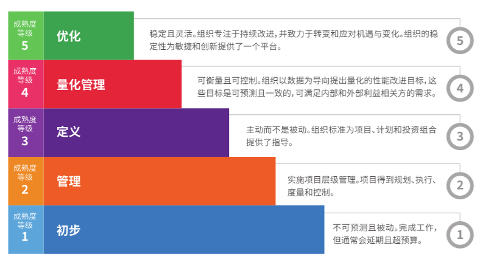

# 2.2 CMMI

CMMI 是软件能力成熟度模型集成（Capability Maturity Model Integra-
tion），是由美国卡耐基梅隆大学软件工程研究所组织全世界的软件过程改进和软件开发管理方面的专家历时四年而开发出来，并在全世界推广实施的一种软件能力成熟度模型， 主要用于指导软件开发过程的改进和进行软件开发能力的评估。

CMMI 实际上是一种管理流程的标准化，其主要目标是创建“产品超前、服务高效、部门高产的可靠环境”。具体来说，CMMI 的目标包括：提供高质量的服务或产品、提高客户满意度、增加利益相关者价值、实现全行业的认可、建立更大的市场份额。

卡耐基梅隆软件工程研究所指出，CMMI 的目的是帮助“整合传统的相对独立功能、设定过程改进目标和优先级，来为质量过程提供指导，并为当前过程提供参考” 。

### CMMI 能带来什么价值

1. 对项目开发过程进行规范，保证软件开发的质量与进度。同时，规范化的流程也有助于提高软件开发者的职业素养，养成好的开发习惯，员工做事方法将变得标准化、规范化。

2. 降低产品开发成本，提高项目控制能力。流程规范后，产品质量随之提高，产品缺陷率也大大降低，客户满意度提升，后期修补和维护的成本大大降低。

3. 提升企业的竞争力。CMMI 是世界范围内认可的软件能力评估标准，越来越多的大型企业要求其工程承包商具有一定的 CMMI 级别。级别高的企业在项目的竞标中具有一定的优势。

### CMMI 的级别

CMMI 成熟度级别提供了强大的标杆评级方法，能把被评估公司的能力与竞争对手、业界和自己的历史进行对比。CMMI 共有5个成熟度级别，代表软件团队能力成熟度的5个等级，数字越大，成熟度越高，高成熟度等级表示有比较强的软件综合开发能力。5个成熟度级别提供了一条清晰的改进路径，任何想提高自己能力的公司，都可以通过识别改进点、解决这些改进点的问题、并把解决方案融入到整个组织的方式来达到更高的成熟度级别。

