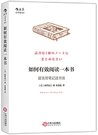
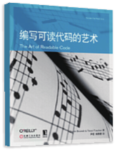
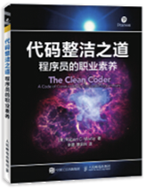
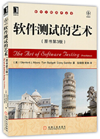
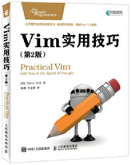
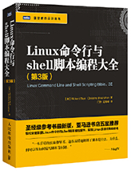
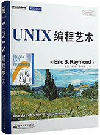
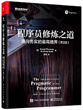
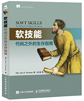
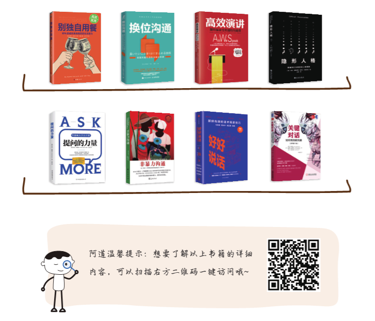

# 4.1 书籍推荐

## 4.1.1 读书的正确姿势

阿道该如何激励你读书，是要说“书籍是人类进步的阶梯”，还是说读书是一种快速进阶的方式呢？读书的好处我们从小到大听过不少了，但道理我都懂，可臣妾做不到哇！尤其处于现在的信息时代，太多浮云遮望眼，找资料容易读书难。那么，阿道就从授人以渔开始，教你如何读书吧。

推荐：《如何阅读一本书》

作者：莫提默·J.艾德勒,查尔斯·范多伦

译者：郝明义，朱衣

解析：每本书的封面之下都有一套自己的骨架，这本书就是教你找出书的骨架。从书籍的层次、主旨到阅读不同体裁的书籍，这本书都从落地方面给到了切实可行的行动建议。不懂阅读或初探阅读的人，读这本书可以少走冤枉路，避免很多无效的阅读，节省大把的时间。

推荐：《如何有效阅读一本书》

作者：奥野宣之

译者：张晶晶

解析：对于一些强功能性的书，你怎样记笔记，决定你记忆得如何。这本书会教你如何用一本笔记，将书中的精华用最高效的方式整理记录下来，更有“葱鲔 （wěi） 火锅式”摘抄法等很多有趣的笔记方法。

## 4.1.2 硬技能

硬技能的书里，除了讲编程的基础，还有很多提高代码可读性的小技巧、黑客的工作方法介绍，也有通过例子和有趣的类比，来讲软件开发不同方面的陷阱。

推荐：《编写可读代码的艺术》

作者：鲍斯维尔（Boswell D.）

译者：尹哲，郑秀雯

解析：插图幽默合理，问题直指要害，方法简单易行。这本书关注编码的细节，总结了很多提高代码可读性的小技巧，看似都微不足道，但是对于整个软件系统的开发而言，它们与宏观的架构决策、设计思想、指导原则同样重要。

推荐：《代码整洁之道》

作者：罗伯特·C. 马丁（Robert C.Martin）

译者：韩磊

解析：本书适合有志于改善代码质量的程序员。书中介绍的规则均来自作者多年的实践经验，涵盖从命名到重构的多个编程方面，只要遵循这些规则，就能编写出干净的代码，从而有效提升代码质量。

推荐：《软件测试的艺术》

作者：Glenford J. Myers,Sandler

译者：张晓明，黄琳

解析：这本书适合软件开发人员、IT项目经理等相关读者阅读，全面而细致地展示了久经考验的软件测试方法和智慧。如果你正在参与重要的软件项目开发，本书仔细研读绝对值得。

推荐：《Vim实用技巧》

作者：Drew Neil

译者：杨源，车文隆

解析：阅读本书是熟练掌握高超的Vim技巧的必由之路。示例丰富，讲解清晰，可帮助读者快速掌握和精通Vim。

推荐：《Linux命令行与shell脚本编程大全》

作者：Ricahard Blum,Christine Bresnahan

译者：门佳，武海峰

解析：看了这本书，你可以轻松写出自己的shell脚本。本书针对Linux系统的最新特性进行了全面更新， 不仅涵盖了详尽的动手教程和现实世界中的实用信息，还提供了与所学内容相关的参考信息和背景资料。

推荐：《UNIX编程艺术》

作者：Eric S.Raymond

译者：姜宏，何源，蔡晓骏

解析：这是一本关于黑客文化的书，书里没有数学公式，甚至连代码也没有。本书主要介绍了Unix系统领域中的设计和开发哲学、 思想文化体系、原则与经验，覆盖面广、内容深邃，完全展现了作者极其深厚的经验积累和领域智慧。

推荐：《程序员修炼之道》

作者：David Thomas,Andrew Hunt

译者：云风

解析：技术是基础，还要辅以其他方面的素质才算从优秀到卓越。这本书可以作为程序员培养个人责任、职业发展、使代码保持灵活并易于改编等基本素质的参考。

## 4.1.3 软技能

在程序员的成长道路上，技能学习需要软硬兼备。程序员在职场上往往会出现很多困惑：为什么专业技能差不多的同事，几年下来，有的人职位晋升，有的人还在原地踏步？是什么造成了这样的差距？又如何解决呢？阿道着重推荐下面这本。

推荐：《软技能⸺代码之外的生存指南》

作者：John Z. Sonmez

译者：王小刚

解析：作者认为每个人要想在这个职场上不吃亏，最好让自己具备不可替代性。而这本书最精彩的地方，并不是一味地在理论上强调软技能有多重要，而是明确给出了培养软技能的方法，程序员们可以随时参照训练。

## 4.1.4 沟通表达类

阿道不能保证，看过这些书就能像呼兰、庞博一样从程序员成功转行脱口秀，但至少可以掌握一些沟通技巧， 解决一些沟通中存在的问题，也能减少日常工作中的阻碍。

比如《换位沟通》中的“1分钟沟通方式”，讲了如何在1分钟内吸引对方注意力，并用对方能听明白的方式讲清这件事的沟通技巧。

#### 其他书籍推荐：

