# 4.2 网站推荐

学技术、卖代码、向大牛们讨经验、寻找项目机会哪家强？这些程序员必逛的国内外网站，一定要上去转转。

## 4.2.1 国外网站推荐

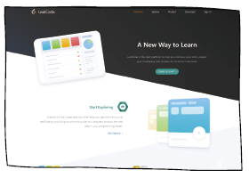

网站：算法学习——LeetCode

网址：leetcode.com

人群：需要刷题的程序员初学者

介绍：LeetCode 覆盖的编程领域比较多，包括算法、数据结构、人工智能、 系统设计等众多领域。它收集了最常见、最高频的编程题目，配有算法学习书籍的配套习题库，每道题都有详细的解答，可供初学者练习。

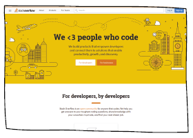

网站：Bug之神——Stack Overflow

网址：stackoverflow.com

人群：初、 高级程序员

介绍：Stack Overflow 可能是拉开初级跟中高级程序员水平的一个网站，实际上，它更像是编程的“十万个为什么”，无论是简单还是复杂的Bug，在这儿基本都会得到解答。这里还是一个很好的交流平台，对于有经验的开发者，还可以来这儿帮助别人解决问题，增加个人影响力。

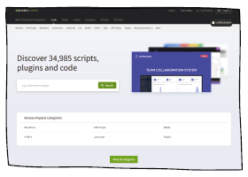

网站：CodeCanyon

网址：codecanyon.net

人群：想卖代码的程序员

介绍：代码也可以放在网上卖的！代码以PHP、WordPress主题、Java、CSS为主，偏前端。给大家来个鲜活的例子：这个网站上的一个19刀的代码卖了3万多份。程序员们，恭喜你们走上了代码致富之路！

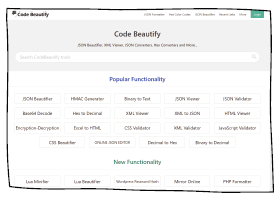

网站：Code Beautify

网址：codebeautify.org

人群：想让代码变美的程序员

介绍：你的代码，曾让别人觉得难以阅读吗？可以用这款代码界的“PhotoShop” 来解救。 Code Beautify 有很多可以美化的语言，可以让代码更容易阅读。另外，如果代码不想被其他人读取，这个网站同样也可以做到。

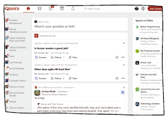

网站：Quora

网址：www.quora.com

人群：想逛国外知乎的程序员

介绍：Quora 是一个问答社交网站，可以理解为国外版的知乎。Quora 上的答案排序功能，会让想学习编程的小伙伴得到自己想要的高质量答案！

## 4.2.2 国内技术社区

网站：博客园

网址：cnblogs.com

介绍：博客园可谓国内众多同类社区中，最为纯净的技术交流社区了。博客园推动并帮助开发者分享技术干货， 从而让更多开发者从中受益。 博客园的使命是帮助开发者用代码改变世界。

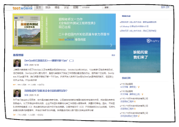

网站：测试窝

网址：testwo.com

介绍：测试窝是一个以软件测试为主题的社区门户。平台提供原创技术写作、海外测试译文、测试招聘发布等内容，还会发布最新海内外测试资讯、线下沙龙活动等。

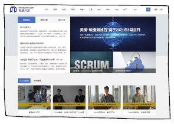

网站：敏捷开发社区

网址：minjiekaifa.com

介绍：敏捷开发中文社区提供敏捷开发相关的知识、视频、培训等相关内容。为大家提供敏捷开发方法学习和更好的敏捷开发软件，以帮助大家更深入和全面地了解敏捷开发。

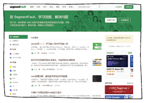

网站：SegmentFault

网址：segmentfault.com

介绍：SegmentFault 是中国新一代的开发者社区和专业的技术媒体。有问答、博客、活动等专区，还组织过多个黑客马拉松活动，为中文开发者提供了纯粹、高质的技术交流平台以及最前沿的技术行业动态。

网站：掘金

网址：juejin.cn

介绍：掘金是一个帮助开发者成长的社区。掘金的技术文章涵盖 Android 、iOS、前端、后端、人工智能等方面的内容。用户每天都可以在这里找到技术世界的头条内容。与此同时，掘金内还有沸点、掘金翻译计划、线下活动、专栏文章等内容。

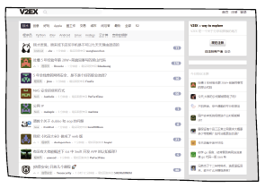

网站：V2EX

网址：v2ex.com

介绍：V2EX是个汇集各类奇妙好玩的话题和流行动向的网站。共分灰色荒野、混沌海、法印城、机械境、极乐境五个区域，其中的机械境区，从 Java 到 Rebol，从 MySQL 到 Sybase，从 Lucene 到 Geronimo，在讨论中，你一定会有所收获。

## 4.2.3 云计算平台

根据中国信通院发布的数据，2016-2019年，中国公共云市场规模逐年上升，增速保持在55%以上。2019年，公共云市场规模达到689.3亿元，同比增长57.6%。

随着云计算的飞速发展，无论是存储、数据库、软件还是网络，越来越多的企业开始使用基于云的企业服务。同时，国内不断地涌现出优秀的云计算服务商，助推企业实现虚拟化、数字化转型。

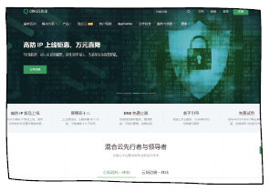

网站：青云QingCloud

网址：qingcloud.com

介绍：青云QingCloud 是一家技术领先的企业级云服务商与数字化转型解决方案提供商，致力于通过一套自主创新、中立可靠、灵活开放的全维云平台为数字世界的高效运行提供坚实的基础支撑，加速推动百行千业数字化转型。

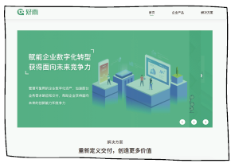

网站：好雨Rainstore云原生应用市场

网址：goodrain.com

介绍：好雨科技专注于“连接企业、让云落地”，通过云帮「Rainbond云原生应用管理平台」和云市「Rainstore云原生应用交易市场」为企业IT能力升级、云原生应用交付、搭建行业生态提供服务和实施工具。

## 4.2.4 公开课网站推荐

网站：Coursera

网址：coursera.org

介绍：Coursera 与多所世界顶尖大学合作，在线提供网络公开课程。Coursera 的首批合作院校包括斯坦福大学、密歇根大学、普林斯顿大学、宾夕法尼亚大学等美国名校。

网站：可汗学院

网址：khanacademy.org

介绍：可汗学院是非营利性组织，使命是为任何地方的任何人提供免费的世界一流的教育。网站汇聚了世界上很多名师，课程范围囊括数学、科学、计算机编程、艺术史、经济学等。

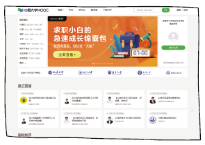

网站：中国大学MOOC网

网址：icourse163.org

介绍：中国版 Coursera，基本都是985、211高校课程，全部免费。

网站：TED

网址：ted.com

介绍：TED 资源多多，涵盖了100多种语言，从科学到商业再到全球的很多内容。满足程序员的多语言学习，适合准备走向世界的程序员。

