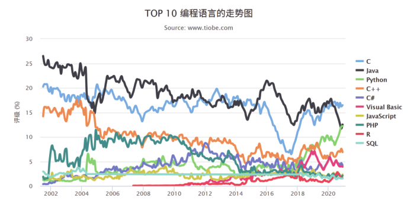

## 1.1 编程语言

编程语言是程序员赖以生存的基础，因此程序员们有必要拓展自己舒适圈边界，让自己 “胖一圈” 。尤其在当下 IT 技术更新迭代迅猛的大环境下，程序员只有不断地投资知识、 管控风险、 提升价值， 才能确保在竞争越发激烈的职场中长期立足。

### 1.1.1 每年学习一门新语言
学习不同的编程语言，有助于让我们拓宽思维，用更多的不同方案来解决同一个问题。学哪门语言呢？右图或许能给你一些启发。

### 1.1.2 每月读一本书
很多编程语言都在不断地更新完善，例如 PHP 已经更新到 PHP8 版本。所以，我们需要不断地学习。没时间读书？建议大家可以充分利用每天的“碎片时间” 来阅读，比如上下班路上、高铁上等。

### 1.1.3 不断尝试、与时俱进
如果你只在 Windows 下工作，可以尝试折腾下 Linux，玩玩 Vim。关注周边最新的技术动态，这样在学习工作中总会不断有新的发现和惊喜。